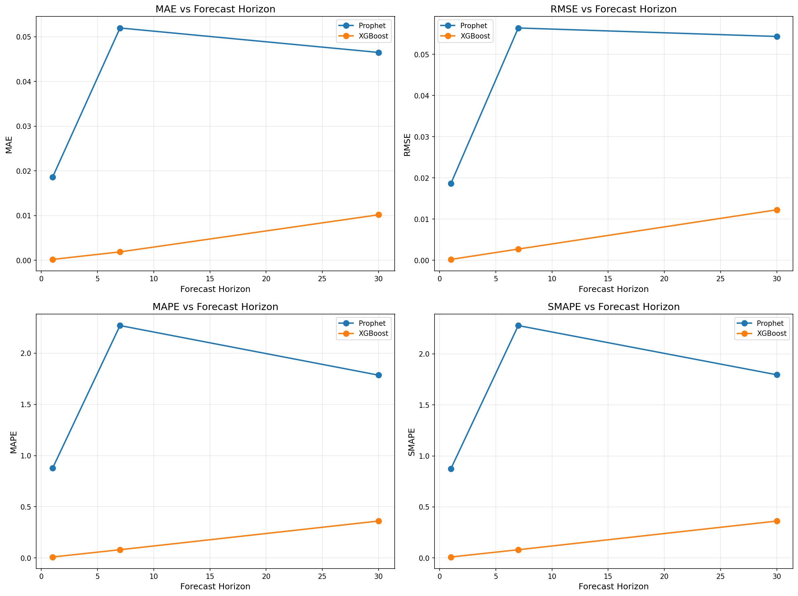
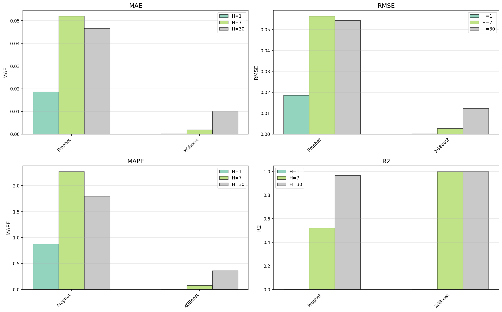
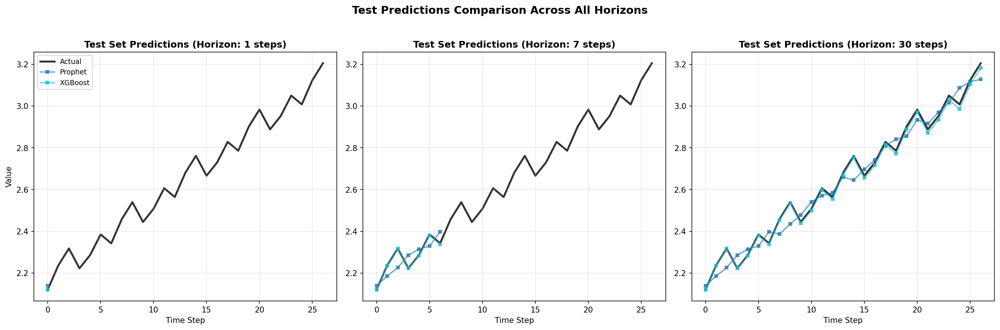

# AI Portfolio⚡

## TL;DR

My portfolio of applied AI and machine learning projects demonstrating various techniques across **time series forecasting**, **natural language processing**, **traditional machine learning** and **data visualisation** tasks, currently including:

#### **Time Series**

- **XGBoost**: Gradient boosting implementation for time series prediction
- **Prophet**: Facebook's forecasting tool for time series with seasonality

##### Capabilities

- Multi-horizon forecasting (e.g., 1-day, 7-day, 30-day ahead)
- Comprehensive metrics: MAE, RMSE, MAPE, SMAPE, R², MASE
- Automated train/validation/test splitting with temporal ordering
- Feature engineering (lag features, date components)
- Model comparison with detailed visualisations
- Persistent model storage and results tracking

#### Product Reviews Classification

* Machine learning based models: logistic regression, naive bayes
* Deep learning based models: feed forward neural network, CNN, RNN (LSTM), GRU,Bi-LSTM with attention
* Pre-trained language models:
  * BERT, RobERTa, DistilBERT (base & fine-tuned)

#### Data Visualisation

Available at [edin-vis.streamlit.app](https://edin-vis.streamlit.app/)

## General Features

Since my main goal here is learning and gaining experience, I have tried to stick to the below principles:

- **Modular Architecture**: Clean separation between different ML domains with reusable pipeline components
- **Production-Ready Code**: Well-structured, documented, and maintainable implementations
- **Comprehensive Evaluation**: Multiple metrics, visualisations, and comparative analysis
- **Configuration-Driven**: Easy experimentation through YAML configuration files
- **Extensible Design**: Framework supports adding new models and project types
- **Modern Libraries**: Uses well-known python packages such as `wandb`,`mlflow`, `pytorch`,`lightning`, `transformers`, `huggingface-hub`, `accelerate`,`unsloth`, `dspy`, `langchain`, `weaviate`

## Project Structure [ongoing]

```text
AI-Portfolio/
├── TimeSeries/              # Time series forecasting
│   ├── configs/
│   │   └── config.yaml      # Model and pipeline configuration
│   ├── data/
│   │   ├── raw/             # Original time series data
│   │   └── processed/       # Processed datasets
│   ├── models/              # Model implementations
│   │   ├── statistical/     # Prophet, ARIMA, ETS, Theta
│   │   ├── ml/              # XGBoost, LightGBM, Random Forest
│   │   └── neural/          # LSTM, GRU, N-BEATS, Transformer
│   ├── src/                 # Core pipeline code
│   │   ├── data_loader.py   # Data loading and preprocessing
│   │   ├── pipeline.py      # Main pipeline orchestration
│   │   ├── evaluate.py      # Evaluation and metrics
│   │   └── utils.py         # Utility functions
│   ├── results/             # Output storage
│   │   ├── models/          # Saved models
│   │   ├── figures/         # Visualisations
│   │   └── metrics/         # Performance metrics
│   ├── main.py              # Entry point
│   └── requirements.txt     # Dependencies
├── NLP/                     # Natural Language Processing tasks
│   ├── configs/
│   │   └── config.yaml      # Model and pipeline configuration
│   ├── data/
│   │   ├── books/   
│   │   ├── dvd/
│   │   ├── electronics/
│   │   └── kitchen_&_housewares/   
│   ├── models/              # Model implementations
│   │   ├── Deep/            # FFNN, CNN, RNN, Transformers
│   │   ├── LMs/             # BERT, RoBERTa, DistilBERT
│   │   └── ml/              # Logistic Regression, Naive Bayes
│   ├── src/                 # Core pipeline code
│   │   ├── data_loader.py   # Data loading and preprocessing
│   │   ├── pipeline.py      # Main pipeline orchestration
│   │   ├── evaluate.py      # Evaluation and metrics
│   │   └── utils.py         # Utility functions
│   ├── results/             # Output storage
│   │   ├── models/          # Saved models
│   │   ├── figures/         # Visualisations
│   │   └── metrics/         # Performance metrics
└── MachineLearning/         # Traditional ML tasks (PLANNED)
```

## Setup

1. **Navigate to the desired directory (TimeSeries, NLP/Classification):**

```bash
cd DIRECTORY
```

1. **Install dependencies:**

```bash
uv python install 3.12
uv venv --python 3.12
source .venv/bin/activate   # optional

uv pip install -r requirements.txt
```

## Usage

Run the pipeline for each sub-project with default settings:

```bash
python main.py
```

### Configuration

Edit `**/configs/config.yaml` in each sub-project. E.g. for the Time Series project you can customise:

- **Data Settings**: File paths, timestamp column, target variables
- **Model Parameters**: Hyperparameters for XGBoost and Prophet
- **Forecast Horizons**: Which time steps ahead to predict (e.g., [1, 7, 30])
- **Evaluation Metrics**: Which metrics to compute

Example configuration for XGBoost:

```yaml
models:
  ml:
    xgboost:
      n_estimators: 100
      max_depth: 6
      learning_rate: 0.1
```

### Experiment Configuration

Define experiments in `**/main.py` e.g.:

```python
EXPERIMENTS = [
    {
        "model": "xgboost",
    },
    {
        "model": "prophet",
    },
]
```

### Results

After running the pipeline, results are saved to:

- **Models**: `**/results/models/`
- **Metrics**: `**/results/metrics/results_summary.json`
- **Figures**: `**/results/figures/`

## Latest Results

Below are the latest model comparison results from the time series forecasting pipeline comparing XGBoost and Prophet across multiple forecast horizons.

### Model Comparison by Horizon

<p align="center">
  
</p>

Comprehensive comparison of model performance across different forecast horizons (1-day, 7-day, 30-day ahead).

### Single Horizon Performance (H=1)

<p align="center">
  
</p>

Detailed performance metrics for 1-step ahead forecasting.

### Test Set Predictions

<p align="center">
  
</p>

Visual comparison of actual vs predicted values on the test set across all forecast horizons.

## Pending⏱️

#### Time Series

- Additional statistical models: ARIMA, ETS, Theta
- Machine learning models: LightGBM, Random Forest, Gradient Boosting
- Deep learning models: xLSTM, GRU, N-BEATS, Transformer, TCN
- Advanced ensemble methods
- Hyperparameter optimisation

#### NLP

- Multi-modal agentic VQA with open-source VLMs
- More open source [thinking] models for classification (nemotron, mistral, qwen, etc. for zero-shot, few-shot, and chain-of-thought prompting)
